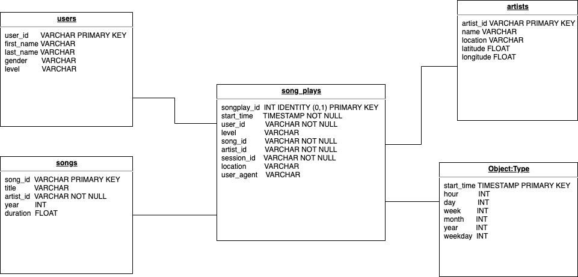

# Data Lake with Spark 

A music streaming startup, Sparkify, has grown their user base and song database even more and want to move their data warehouse to a data lake. Their data resides in S3, in a directory of JSON logs on user activity on the app, as well as a directory with JSON metadata on the songs in their app.

### Project Steps

In that project below steps implemented:

1. Building an ETL pipeline that extracts data from S3
2. Process data using Spark 
3. Load back into S3 as a set of dimensional tables

### Database Schema

The star shema details shown below

### Project Datasets

Datasets reside in S3.

* Song data: s3://udacity-dend/song_data 
* Log data: s3://udacity-dend/log_data 

1. Song Dataset

Each file is in JSON format and contains metadata about a song and the artist of that song. The files are partitioned by the first three letters of each song's track ID.

`song_data/A/B/C/TRABCEI128F424C983.json song_data/A/A/B/TRAABJL12903CDCF1A.json`

JSON file looks like;

`{"num_songs": 1, "artist_id": "ARJIE2Y1187B994AB7", "artist_latitude": null, "artist_longitude": null, "artist_location": "", "artist_name": "Line Renaud", "song_id": "SOUPIRU12A6D4FA1E1", "title": "Der Kleine Dompfaff", "duration": 152.92036, "year": 0}`

2. Log Dataset

Log files in JSON format generated by this event simulator based on the songs in the dataset

`log_data/2018/11/2018-11-12-events.json`
`log_data/2018/11/2018-11-13-events.json`

